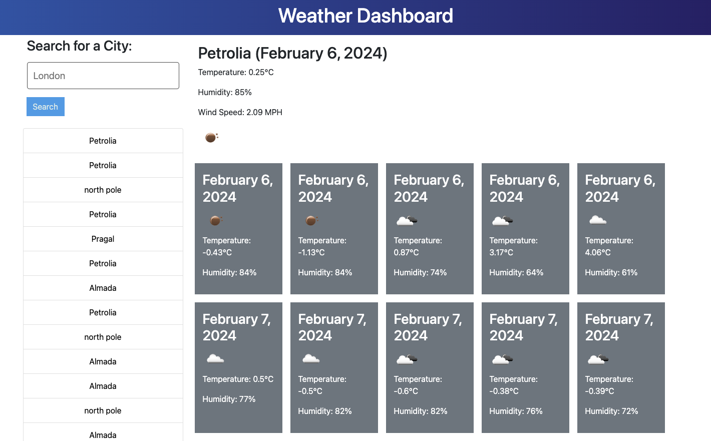

# WeatherAt

WeatherAt is a weather dashboard web app that allows users to check the current weather and 5-day forecast for multiple cities using OpenWeatherMap API to retrieve weather data.

## Features
- Users can search for cities to view current weather conditions and a 5-day forecast.
- The application stores search history using localStorage for easy access to previously searched cities.
- Clean and intuitive user interface.
- Responsive design for seamless viewing on different devices.


## Usage
To use WeatherAt, simply enter the name of a city in the search input field and click the "Search" button. 
The application will display the current weather conditions and a 5-day forecast for the selected city. 
You can also click on any city in the search history to view weather information for that city again.

## Installation
To run WeatherAt locally, follow these steps:

1. Open the Terminal on your device.

2. Clone the repository:

   ```bash
   git clone https://github.com/DanielaDeMoura/WeatherAt.git

3. Open the index.html file in your preferred web browser.